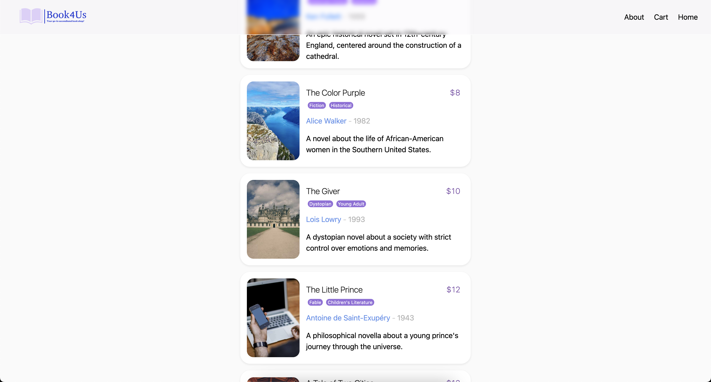

# Book4Us



Welcome to **Book4Us**, a simple fullstack bookshop demo.

## Project Overview

Book4Us is powered by:

+ **Ktor Client:** A powerful HTTP client for Kotlin that enables seamless communication with the remote server to fetch
  book data.
+ **Kotlin Serialization (JSON):** A modern serialization library for Kotlin that simplifies the parsing and
  serialization of JSON data.
+ **Kotlin Coroutines:** A concurrency framework for Kotlin that allows for efficient and expressive asynchronous
  programming.
+ **Compose HTML:** A not very well-known port of Compose Multiplatform that targets HTML as the output, enabling the
  creation of dynamic and interactive web pages.
+ **Kobweb:** A modern, Kotlin-based web framework that leverages the power of Compose HTML for building web
  applications.
+ **SQLDelight:** A powerful library for generating typesafe Kotlin APIs from SQL statements, ensuring compile-time
  verification of schema, statements, and migrations, and offering enhanced IDE features for seamless SQL writing and
  maintenance.

## Key Features

### Fetching Data

Book4Us uses suspending functions inside coroutines to fetch book catalog data from a remote server. The application
utilizes Ktor Client, a powerful HTTP client for Kotlin, to make asynchronous network requests and retrieve the JSON
data. By leveraging Kotlin Coroutines, Book4Us ensures that the UI remains responsive during the data fetching process,
providing a seamless user experience.

### Caching

To optimize performance and reduce network requests, Book4Us implements a caching mechanism that stores the fetched book
catalog data in local storage. This caching strategy ensures that the data is readily available for subsequent visits to
the website, eliminating the need to fetch the data from the remote server each time. By caching the data locally,
Book4Us significantly improves the loading speed and responsiveness of the application.

### Advanced Search

Book4Us features an advanced search functionality that allows users to search for books based on specific criteria,
such as title and description, author, or a group of genres, plus sorting by price. The search functionality is
implemented using Kotlin Coroutines, enabling users to perform real-time searches without blocking the UI. As users type
in the search query, Book4Us dynamically filters the book catalog data and displays the relevant results, providing a
seamless and interactive search experience.

### Checkout

Book4Us provides a simple and intuitive checkout process that allows users to add books to their cart and proceed to
checkout. The checkout process is designed to be user-friendly, with extremely clear and concise user interface. Users
can easily view the books in their cart, clear the cart, and proceed to checkout to complete their purchase. The cart
items are persisted in local storage, ensuring that users can return to the website and continue their shopping
experience without losing their cart items.

### Parsing and Displaying Data

Once the book catalog data is fetched from the remote server, Book4Us efficiently parses the JSON data using Kotlinx
Serialization. The parsed data is then dynamically rendered on the webpage using Compose HTML. The application
generates the necessary HTML elements to display the book information in a visually appealing and user-friendly manner.

### Error Handling

Book4Us places a strong emphasis on robust error handling. Each asynchronous method is equipped with appropriate error
handling mechanisms to gracefully handle network errors or parsing failures, as a part of the return type. In case of
any issues, informative error messages are displayed to the user, ensuring a smooth and uninterrupted user experience.

### User Interface

The user interface of Book4Us is designed with simplicity and intuitiveness in mind. The application features a clean
and modern design, making it easy for users to navigate and explore the book catalog. The Home page serves as the main
hub, presenting a list of books with relevant information such as title, author, and genres. In the future, Users will
be able to effortlessly sort the books by title or price to find their desired books quickly.

### Responsiveness

Book4Us is built with responsiveness in mind, ensuring that the application adapts seamlessly to different screen sizes
and devices. The website is designed to provide an optimal viewing experience across a wide range of devices, including
desktops, laptops, tablets, and smartphones. The responsive design ensures that users can access and interact with the
application comfortably, regardless of the device they are using.

### Documentation

Comprehensive documentation is provided right here, to guide developers through the details of Book4Us.

### Top Navigation Bar

The Book4Us website features a sticky top navigation bar that remains fixed at the top of the page as the user scrolls
down. This navigation bar provides quick access to essential sections of the website, such as the Home page and About
page, ensuring easy navigation and a seamless user experience. The menu items fold into a hamburger menu on smaller
screens, optimizing the user experience for mobile devices.

### A Funny Hack

The Book API used by the project doesn't provide any price information for the books. Since this is a shop, it needs
price tags. So, the project uses a funny hack to use the hash code of the book title as an input, and then generates a
price based on that hash code. This ensures that each book has a price, and the price remains consistent for the same
book title.

## Pages

The project consists of the following main pages:

+ **Home Page:** The landing page of Book4Us, where users can view the list of books.

+ **About Page:** Provides information about the Book4Us project, its purpose, and the technologies used.

## How to Use

This project uses the [Kobweb](https://github.com/varabyte/kobweb) framework under the hood, which is a modern,
Kotlin-based web framework that leverages the power of Compose HTML for building web applications.

### Development Setup

First, run the development server by typing the following command in a terminal under the `site` folder:

```bash
$ cd site
$ kobweb run
```

Open [http://localhost:8080](http://localhost:8080) with your browser to see the result.

You can use any editor you want for the project, but using **IntelliJ IDEA Community Edition** is highly recommended.

Press `Q` in the terminal to gracefully stop the server.

### Exporting the Project

To export the final fullstack output, shutdown the development server and then export the project using:

```bash
$ kobweb export
```

When finished, you can run a Kobweb server in production mode to test it.

```bash
$ kobweb run --env prod
```
